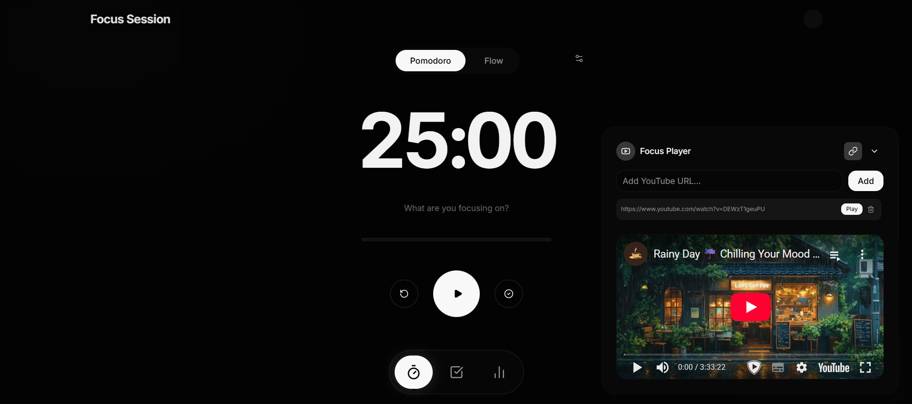
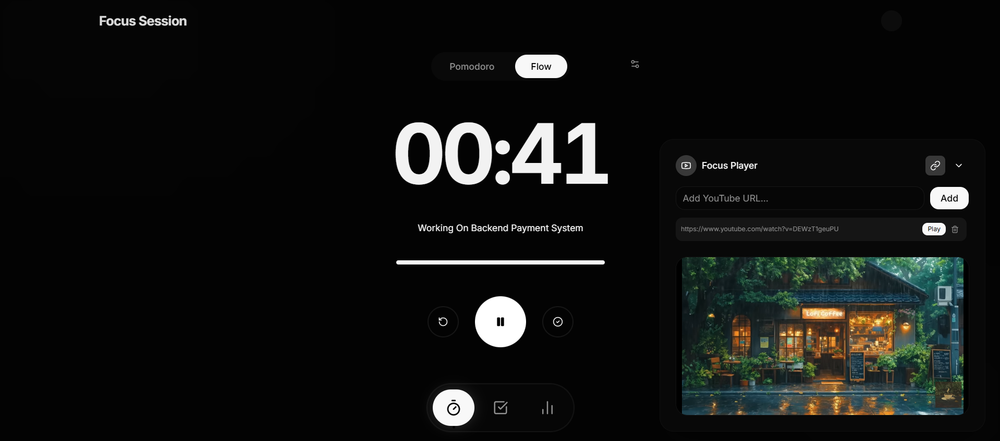
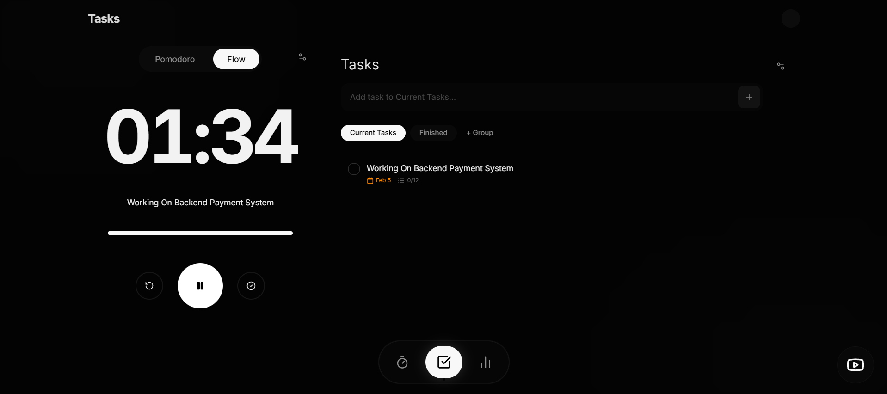
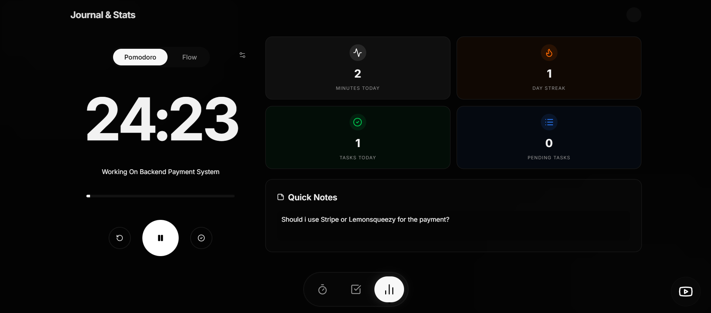

# 🎯 Focus

[](https://nextjs.org/)
[](https://reactjs.org/)
[](https://tailwindcss.com/)
[](https://www.typescriptlang.org/)
[](https://zustand-demo.pmnd.rs/)
[](https://opensource.org/licenses/MIT)

**Focus** is a modern, minimalist productivity application designed to help you stay in the flow. Whether you're working, studying, or relaxing, Focus provides the tools you need to manage your time and environment.



---

## ✨ Features

- **⏱️ Focus Timer**: A beautiful pomodoro-style timer to manage your deep work sessions.
- **✅ Task Management**: A sleek To-Do list to keep track of your daily goals.
- **📊 Stats & Journal**: Visualize your productivity and document your journey.
- **🎵 Ambient Media Player**: Integrated player for focus music and ambient sounds.
- **🎨 Dynamic UI**: Smooth transitions and an adaptive background that changes based on your task.
- **📱 Responsive Design**: Fully optimized for desktop and mobile devices.

---

## 📸 Gallery

<details>
<summary>Click to view more screenshots</summary>

### Focus Timer



### Task Management



### Stats & Journal



</details>

---

## 🛠️ Tech Stack

- **Core**: [Next.js](https://nextjs.org/) (App Router), [React](https://reactjs.org/)
- **Language**: [TypeScript](https://www.typescriptlang.org/)
- **Styling**: [Tailwind CSS 4](https://tailwindcss.com/), [shadcn/ui](https://ui.shadcn.com/)
- **Icons**: [Lucide React](https://lucide.dev/)
- **State Management**: [Zustand](https://zustand-demo.pmnd.rs/)
- **Date Utilities**: [date-fns](https://date-fns.org/)
- **Components**: [Radix UI](https://www.radix-ui.com/)

---

## 🚀 Getting Started

### Prerequisites

- Node.js (Latest LTS recommended)
- npm / yarn / pnpm

### Installation

1. **Clone the repository:**

    ```bash
    git clone https://github.com/your-username/focus.git
    cd focus
    ```

2. **Install dependencies:**

    ```bash
    npm install
    ```

3. **Run the development server:**

    ```bash
    npm run dev
    ```

4. **Open your browser:**
   Navigate to [http://localhost:3000](http://localhost:3000) to see the app in action.

---

## 📝 License

Distributed under the MIT License. See `LICENSE` for more information.

---

## 🙌 Contributing

Contributions are what make the open-source community such an amazing place to learn, inspire, and create. Any contributions you make are **greatly appreciated**.

1. Fork the Project
2. Create your Feature Branch (`git checkout -b feature/AmazingFeature`)
3. Commit your Changes (`git commit -m 'Add some AmazingFeature'`)
4. Push to the Branch (`git push origin feature/AmazingFeature`)
5. Open a Pull Request
